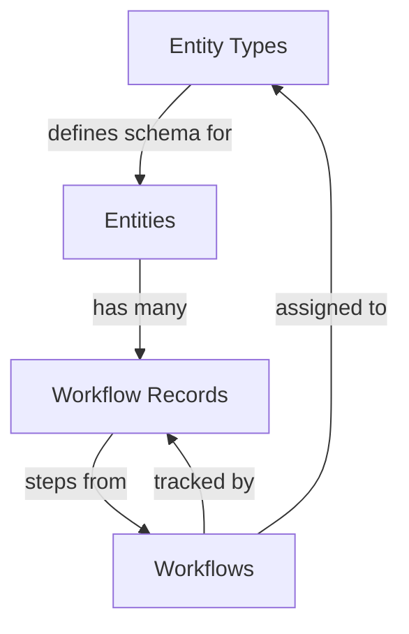

# PalmVue Revamp Web - Project Overview

## Project Description

**PalmVue Revamp** is a Next.js 16 web application for managing **entities** and **workflows**. It functions as a client-side application using browser **localStorage** for data persistence, featuring dynamic schema-based forms and multi-step workflow orchestration.

---

## Technology Stack

| Category        | Technology                                           |
| --------------- | ---------------------------------------------------- |
| **Framework**   | Next.js 16.0.10 (App Router)                         |
| **Language**    | TypeScript 5.x                                       |
| **UI Library**  | React 19.2.1                                         |
| **Styling**     | Tailwind CSS 4.x                                     |
| **Components**  | Radix UI primitives (shadcn/ui pattern)              |
| **Icons**       | Lucide React                                         |
| **Forms**       | React Hook Form + Zod validation                     |
| **Drag & Drop** | @dnd-kit/core, @dnd-kit/sortable, @dnd-kit/modifiers |
| **Charts**      | Recharts                                             |
| **JSON Editor** | Monaco Editor (@monaco-editor/react)                 |
| **IDs**         | UUID                                                 |

---

## Core Domain Model

The application is built around **four interconnected concepts**:



### 1. Entity Types

Blueprints that define custom data structures using JSON Schema.

- Contains `metadata_schema` (JSON Schema) defining fields for entity instances
- Has a `prefix` for auto-generating entity codes (e.g., "PALM" → "PALM-001")

### 2. Entities

Instances of entity types with concrete data.

- Auto-generates unique codes using entity type prefix + sequential numbering
- Supports hierarchical relationships via `parent_id`
- Metadata must conform to the entity type's schema

### 3. Workflows

Multi-step process definitions.

- Each step contains a form definition (JSON Schema)
- Can be assigned to entity types

### 4. Workflow Records

Track progress when entities go through workflows.

- Statuses: `not_started`, `in_progress`, `completed`
- Records step submissions with timestamps
- Automatically advances through workflow steps

---

## Project Structure

```
src/
├── app/                          # Next.js App Router pages
│   ├── layout.tsx               # Root layout with sidebar
│   ├── page.tsx                 # Dashboard/Home page
│   ├── ai-assistant/            # AI Chatbot demo page
│   ├── analytics/               # Analytics dashboard
│   ├── entities/                # Entity management
│   │   ├── page.tsx            # Entity list
│   │   ├── [id]/page.tsx       # Entity detail
│   │   └── new/page.tsx        # Create entity
│   ├── entity-types/            # Entity type management
│   │   ├── page.tsx            # Entity type list
│   │   ├── [id]/page.tsx       # Entity type detail
│   │   └── new/page.tsx        # Create entity type
│   └── workflows/               # Workflow management
│       ├── page.tsx            # Workflow list
│       ├── [id]/page.tsx       # Workflow detail
│       └── new/page.tsx        # Create workflow
│
├── components/
│   ├── entities/               # Entity-specific components
│   │   ├── EntityForm.tsx
│   │   ├── EntityList.tsx
│   │   ├── EntityDetail.tsx
│   │   └── JsonSchemaForm.tsx  # Dynamic form renderer
│   ├── entity-types/           # Entity type components
│   │   ├── EntityTypeForm.tsx
│   │   ├── EntityTypeList.tsx
│   │   └── EntityTypeDetail.tsx
│   ├── workflows/              # Workflow components
│   │   ├── WorkflowForm.tsx    # Drag-and-drop builder
│   │   ├── WorkflowList.tsx
│   │   ├── WorkflowDetail.tsx
│   │   └── WorkflowProgress.tsx # Step progression UI
│   ├── schema-builder/         # JSON Schema visual builder
│   │   └── SchemaBuilder.tsx   # Drag-and-drop field editor
│   ├── layout/                 # Layout components
│   │   ├── Sidebar.tsx
│   │   └── TopBar.tsx
│   ├── providers/              # Context providers
│   │   └── DatabaseProvider.tsx # Mock data seeding
│   └── ui/                     # shadcn/ui components (25 components)
│
├── hooks/                       # Custom React hooks
│   ├── useEntityTypes.ts       # CRUD for entity types
│   ├── useEntities.ts          # CRUD for entities
│   ├── useWorkflows.ts         # CRUD for workflows
│   ├── useWorkflowRecords.ts   # CRUD for workflow records
│   └── useLocalStorage.ts      # localStorage sync hook
│
├── types/                       # TypeScript definitions
│   ├── entity-type.ts
│   ├── entity.ts
│   ├── workflow.ts
│   └── workflow-record.ts
│
├── data/                        # Mock data
│   ├── mock-entity-types.ts
│   ├── mock-entities.ts
│   ├── mock-workflows.ts
│   └── mock-workflow-records.ts
│
└── lib/                         # Utilities
    ├── constants.ts             # Storage keys, app constants
    ├── storage.ts               # SSR-safe localStorage wrapper
    ├── code-generator.ts        # Entity code generation
    └── utils.ts                 # Tailwind utilities (cn)
```

---

## Data Flow Architecture

```
┌─────────────────┐    ┌─────────────────┐    ┌─────────────────┐    ┌─────────────────┐
│   Components    │ -> │  Custom Hooks   │ -> │ useLocalStorage │ -> │   localStorage  │
└─────────────────┘    └─────────────────┘    └─────────────────┘    └─────────────────┘
```

### Storage Keys (defined in `src/lib/constants.ts`)

- `palmvue_entity_types`
- `palmvue_entities`
- `palmvue_workflows`
- `palmvue_workflow_records`
- `palmvue_entity_type_workflows`
- `palmvue_initialized`

---

## Key Features

### Dynamic Form System

Two complementary systems for JSON Schema handling:

1. **SchemaBuilder** - Visual editor for creating JSON Schemas with drag-and-drop field reordering
2. **JsonSchemaForm** - Renders forms from JSON Schema, supporting: string, number, integer, boolean, date, enum

### Auto-Provisioning

When an entity is created:

1. Generates unique code using entity type prefix + sequential number
2. Looks up workflows assigned to that entity type
3. Creates WorkflowRecord instances for each assigned workflow
4. Sets all workflow records to `not_started` status

### Code Generation

Entity codes follow pattern: `PREFIX-001`, `PREFIX-002` (zero-padded to 3 digits)

---

## Pages & Routes

| Route                | Description                                |
| -------------------- | ------------------------------------------ |
| `/`                  | Dashboard with overview stats and charts   |
| `/entity-types`      | List all entity types                      |
| `/entity-types/new`  | Create new entity type                     |
| `/entity-types/[id]` | Entity type detail with assigned workflows |
| `/entities`          | List all entities with filtering           |
| `/entities/new`      | Create new entity                          |
| `/entities/[id]`     | Entity detail with workflow progress       |
| `/workflows`         | List all workflows                         |
| `/workflows/new`     | Drag-and-drop workflow builder             |
| `/workflows/[id]`    | Workflow detail view                       |
| `/ai-assistant`      | AI chatbot demo page                       |
| `/analytics`         | Analytics dashboard                        |

---

## Development Commands

```bash
# Start development server (http://localhost:3000)
npm run dev

# Production build
npm run build

# Start production server
npm start

# Run linter
npm run lint
```

---

## UI Components Library

The project uses **shadcn/ui** pattern with **Radix UI** primitives. Available components in `src/components/ui/`:

- AlertDialog, Button, Card, Checkbox, Dialog
- DropdownMenu, Input, Label, Popover, ScrollArea
- Select, Separator, Tabs, Textarea, Tooltip
- Table (with pagination support)
- And more...

---

## Mock Data

The `DatabaseProvider` seeds initial data on first load including:

- **Entity Types**: Palm Tree, Plot, Worker, Equipment, etc.
- **Entities**: Multiple instances across different types
- **Workflows**: Multi-step workflows with form definitions
- **Workflow Records**: Records at various completion stages
