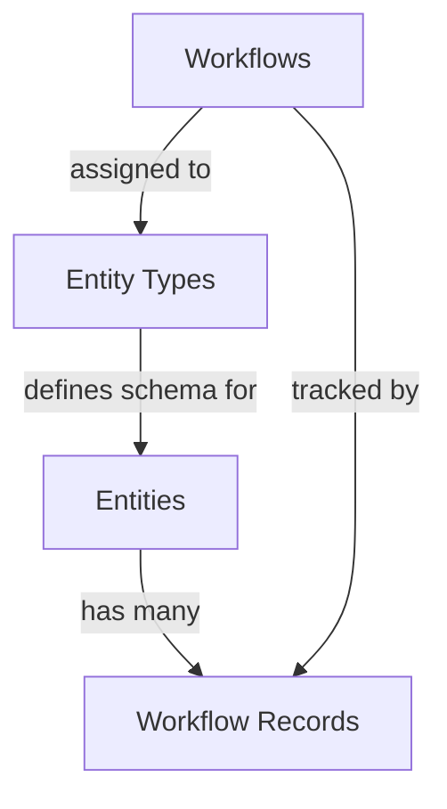

# PalmVue Revamp Web - Project Overview

## Project Description

**PalmVue Revamp** is a Next.js web application for managing **entities** and **workflows**. It provides dynamic schema-based forms and multi-step workflow orchestration for palm plantation management.

---

## Technology Stack

| Category        | Technology                              |
| --------------- | --------------------------------------- |
| **Framework**   | Next.js 16 (App Router)                 |
| **Language**    | TypeScript 5.x                          |
| **UI Library**  | React 19                                |
| **Styling**     | Tailwind CSS 4.x                        |
| **Components**  | Radix UI primitives (shadcn/ui pattern) |
| **Icons**       | Lucide React                            |
| **Forms**       | React Hook Form + Zod validation        |
| **State**       | React Query (TanStack Query)            |
| **HTTP Client** | Axios                                   |
| **Drag & Drop** | @dnd-kit                                |
| **Charts**      | Recharts                                |
| **JSON Editor** | Monaco Editor                           |

---

## Core Domain Model



### 1. Entity Types

Blueprints defining custom data structures using JSON Schema.

- Contains `metadata_schema` defining fields for entity instances
- Has a `prefix` for auto-generating entity codes (e.g., "PALM" → "PALM-001")

### 2. Entities

Instances of entity types with concrete data.

- Auto-generates unique codes using entity type prefix + sequential numbering
- Supports hierarchical relationships via `parent_id`
- Metadata conforms to the entity type's schema

### 3. Workflows

Multi-step process definitions.

- Each step contains a form definition (JSON Schema)
- Can be assigned to entity types

### 4. Workflow Records

Track progress when entities go through workflows.

- Statuses: `not_started`, `in_progress`, `completed`
- Records step submissions with timestamps

---

## Project Structure

```
src/
├── app/                          # Next.js App Router pages
│   ├── layout.tsx               # Root layout with providers
│   ├── page.tsx                 # Dashboard
│   ├── entities/                # Entity CRUD (list, new, [id])
│   ├── entity-types/            # Entity type CRUD
│   ├── workflows/               # Workflow CRUD
│   ├── ai-assistant/            # AI chatbot demo
│   └── analytics/               # Analytics dashboard
│
├── api/                          # API integration layer
│   ├── client.ts                # Axios instance with interceptors
│   ├── endpoints.ts             # API endpoint constants
│   ├── services/                # Domain services (authService)
│   └── types/                   # API types (common, auth)
│
├── components/
│   ├── entities/                # Entity components
│   ├── entity-types/            # Entity type components
│   ├── workflows/               # Workflow components
│   ├── schema-builder/          # JSON Schema visual builder
│   ├── layout/                  # Sidebar, TopBar
│   ├── providers/               # QueryProvider, AuthProvider
│   └── ui/                      # shadcn/ui components (26)
│
├── hooks/                        # Custom React hooks
│   ├── queries/                 # React Query hooks
│   ├── useEntityTypes.ts
│   ├── useEntities.ts
│   ├── useWorkflows.ts
│   └── useWorkflowRecords.ts
│
├── types/                        # Domain type definitions
│   ├── entity-type.ts
│   ├── entity.ts
│   ├── workflow.ts
│   └── workflow-record.ts
│
└── lib/                          # Utilities
    ├── cn.ts                    # Tailwind class merge utility
    ├── token.ts                 # Auth token management
    ├── constants.ts             # App constants
    └── date.ts, string.ts       # Helper utilities
```

---

## Key Features

### Dynamic Form System

- **SchemaBuilder** - Visual editor for creating JSON Schemas with drag-and-drop
- **JsonSchemaForm** - Renders forms from JSON Schema (string, number, boolean, date, enum)

### Auto-Provisioning

When an entity is created:

1. Generates unique code using entity type prefix + sequential number
2. Creates WorkflowRecord instances for each assigned workflow

### Code Generation

Entity codes follow pattern: `PREFIX-001`, `PREFIX-002` (zero-padded)

---

## Pages & Routes

| Route                | Description                     |
| -------------------- | ------------------------------- |
| `/`                  | Dashboard with stats and charts |
| `/entity-types`      | Entity type list                |
| `/entity-types/new`  | Create entity type              |
| `/entity-types/[id]` | Entity type detail              |
| `/entities`          | Entity list with filtering      |
| `/entities/new`      | Create entity                   |
| `/entities/[id]`     | Entity detail with workflows    |
| `/workflows`         | Workflow list                   |
| `/workflows/new`     | Workflow builder                |
| `/workflows/[id]`    | Workflow detail                 |
| `/ai-assistant`      | AI chatbot demo                 |
| `/analytics`         | Analytics dashboard             |

---

## Development Commands

```bash
npm run dev      # Start dev server (http://localhost:3000)
npm run build    # Production build
npm start        # Start production server
npm run lint     # Run linter
```

---

## Provider Architecture

```tsx
<QueryProvider>
  <AuthProvider>
    <DatabaseProvider>{children}</DatabaseProvider>
  </AuthProvider>
</QueryProvider>
```

- **QueryProvider**: React Query client for server state
- **AuthProvider**: Authentication state and login/logout
- **DatabaseProvider**: Mock data seeding (temporary)
